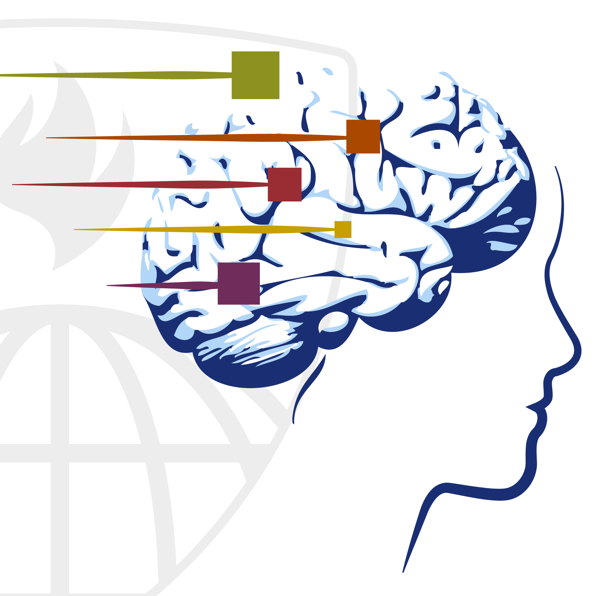
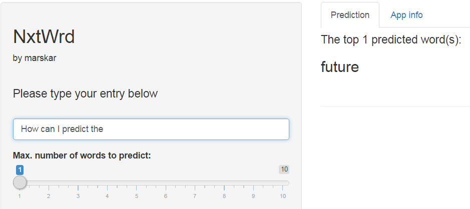

Coursera Data Science Specialization Capstone
========================================================

 By Martin Skarzynski 

 Introducing... &nbsp; &nbsp; &nbsp; &nbsp; &nbsp; &nbsp; &nbsp; &nbsp; &nbsp; &nbsp; &nbsp; &nbsp; &nbsp; &nbsp; &nbsp; &nbsp; &nbsp; &nbsp; &nbsp; &nbsp; **[NxtWrd](https://marskar.shinyapps.io/DScapFinal/)** 

 A Shiny app for next word text prediction.

  

Background
========================================================

The [NxtWrd](https://marskar.shinyapps.io/DScapFinal/) app predicts the subsequent word based on text entered by the user. 

- The prediction algorithm underlying the app was developed using a large dataset, consisting of news articles, tweets (Twitter), and blog posts.
- The original data is available for download [here](https://d396qusza40orc.cloudfront.net/dsscapstone/dataset/Coursera-SwiftKey.zip) in zip format. The data are quite large (~548MB), so 50000 line samples were obtained from each dataset.
- Profanity was removed using two profanity lists created by github users [LDNOOBW](https://github.com/LDNOOBW/List-of-Dirty-Naughty-Obscene-and-Otherwise-Bad-Words/blob/master/en) and [jamiew](https://gist.github.com/jamiew/1112488).
- The data processing was done with only the [tm package](https://www.jstatsoft.org/article/view/v025i05), and the app additionally requires the [Shiny](https://shiny.rstudio.com/) and [markdown](https://daringfireball.net/projects/markdown/) packages.

 

Methods and Design
========================================================

- The data samples were submitted to a process called [tokenization](http://en.wikipedia.org/wiki/Tokenization_%28lexical_analysis%29), through which words are grouped into so-called [N-grams](http://en.wikipedia.org/wiki/N-gram). 
- Lists of uni- to heptagrams (i.e. 1 to 7 words) were generated using the [ngram_tokenizer](https://raw.githubusercontent.com/zero323/r-snippets/master/R/ngram_tokenizer.R) snippet created by Maciej Szymkiewicz, aka [zero323](https://github.com/zero323/r-snippets/tree/master/R) on Github.
- These lists were ordered by frequency and converted into dataframes to be used in a simple backoff model, which moves from heptagrams to bigrams, until it finds and returns a match or exhausts all of available data.
- If no match is found, common words (top unigrams) are suggested. In other words, [NxtWrd](https://marskar.shinyapps.io/DScapFinal/) will always provide a suggestion, even when confronted with unknown words.

 

App Usage and Interface
========================================================

The user interface is very simple, consisting of 
- A box for text entry, a slider to set the maximum number of words that can be returned,
- The *Prediction* tab, which shows the current slider setting and predicted word(s), and
- The *App info* tab, which has documentation and links.

 

Conclusions and Final Thoughts
========================================================

- [NxtWrd](https://marskar.shinyapps.io/DScapFinal/) is a versatile app for next word prediction that can easily be adapted to other datasets. For example, data frames consisting of ngrams from other languages and fed into the app to provide foreign language support. 
- Minimal dependencies and small datasets allow [NxtWrd](https://marskar.shinyapps.io/DScapFinal/) to run in real time.
- The code (available at [this GitHub repo](https://github.com/marskar/DScapFinal)) is designed to be robust and readable. Feel free to use it to prepare new datasets and set up your own instance of [NxtWrd](https://marskar.shinyapps.io/DScapFinal/). There is surely room for improvement, so suggestions and pull requests are welcome and appreciated!
- To learn more about the Coursera Data Science Specialization, please visit [this webpage](https://www.coursera.org/specialization/jhudatascience).

 
